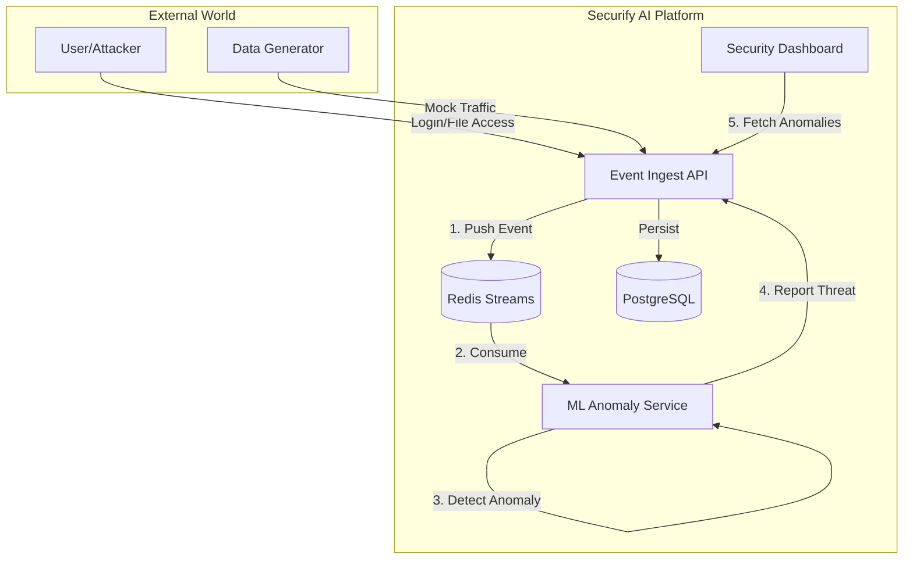

# Securify AI

> **Real-time Security Anomaly Detection System powered by AI.**

[](https://www.python.org/)
[](https://fastapi.tiangolo.com/)
[](https://streamlit.io/)
[](https://redis.io/)
[](https://docs.docker.com/compose/)

**Securify AI** is a modern, event-driven security platform that ingests high-velocity logs, detects anomalies in real-time using Machine Learning, and visualizes threats on a live dashboard.

---

## Architecture

The system follows a microservices architecture powered by **Redis Streams** for asynchronous communication.



## Features

-   **High-Performance Ingestion**: FastAPI-based ingestion layer capable of handling high throughput.
-   **AI-Powered Detection**: Uses Isolation Forests / Statistical models to detect anomalous login patterns and file access.
-   **Event-Driven**: Fully asynchronous processing using Redis Streams.
-   **Live Dashboard**: Interactive Streamlit dashboard for Security Operations Centers (SOC).
-   **Secure by Design**: JWT Authentication enforced for all internal and external communication.
-   **Dockerized**: Ready to deploy with a single command.

---

## Tech Stack

-   **Services**: Python, FastAPI, Streamlit
-   **ML Engine**: Scikit-learn, Pandas
-   **Broker**: Redis (Streams)
-   **Database**: PostgreSQL
-   **Infrastructure**: Docker Compose, Kubernetes (Manifests included)

---

## Use Cases
*See [docs/USAGE_GUIDE.md](docs/USAGE_GUIDE.md) for full integration details.*

1.  **Corporate Security**: Detect unusual employee logins (e.g., from wrong countries).
2.  **App Protection**: Stop credential stuffing attacks on your Login page.
3.  **Server Monitoring**: Watch SSH logs (`/var/log/auth.log`) for brute-force attempts.

---

## Getting Started

### Prerequisites

-   **Docker** and **Docker Compose** installed.
-   (Optional) **Python 3.10+** for local development.

### 1. Clone the Repository

```bash
git clone https://github.com/Shafiyullah/securify-ai.git
```
```bash
cd securify-ai
```

### 2. Configure Environment

Create a `.env` file in the root directory. You can copy the example below:

```bash
POSTGRES_PASSWORD=password
JWT_SECRET_KEY=secret-key
```

> **Security Note**: Never commit your `.env` file. The `JWT_SECRET_KEY` is used to sign tokens for internal service communication.

### 3. Run with Docker Compose

Build and start all services:

```bash
docker-compose --env-file .env up --build
```

Access the services:
-   **Dashboard**: http://localhost:8501
-   **API Docs**: http://localhost:8000/docs

---

## Usage Guide

### 1. Log in to the Dashboard
Open http://localhost:8501
-   **Username**: `admin`
-   **Password**: (The value you set for `DASHBOARD_PASSWORD` in .env)

### 2. Generate Mock Traffic
The project includes a data generator to simulate traffic (logins, file changes).
It runs automatically in Docker, but you can trigger it manually:

Run inside the generator container
```bash
docker-compose exec data-generator python generate.py
```

### 3. View Anomalies
As the generator sends data:
1.  **Ingest Service** receives logs.
2.  **ML Service** analyzes them in the background.
3.  If a "Brute Force" attack or "Suspicious File Access" is detected, it appears on the **Dashboard**.

---

## Easy Integration

We provide ready-to-use tools to connect your systems in minutes:

### 1. For Developers (Python SDK)
Use our pre-built client to log events from your code.
```python
# Copy integrations/python-client/securify_client.py to your project
from securify_client import SecurifyClient

client = SecurifyClient(api_url="http://localhost:8000", api_token="YOUR_TOKEN")
client.log_login(username="admin", success=False)
```

### 2. For Sysadmins (Log Shipper)
Watch server logs (like SSH) and forward them automatically.
```bash
python integrations/log-shipper/log_shipper.py --file /var/log/auth.log --token YOUR_TOKEN
```

---

## Project Structure

```
├── automation/          # Data generators and tests
├── infrastructure/      # K8s manifests and deploy scripts
├── services/
│   ├── event-ingest-stream/  # FastAPI Ingestion Service
│   ├── ml-anomaly-service/   # ML Worker (Redis Consumer)
│   └── security-dashboard/   # Streamlit UI
├── docker-compose.yml   # Local orchestration
└── .gitignore           # Git ignore rules
```

## Contributing

Contributions are welcome! Please follow these steps:
1.  Fork the repo.
2.  Create a feature branch (`git checkout -b feature/amazing-feature`).
3.  Commit your changes.
4.  Open a Pull Request.

## License

Distributed under the MIT License. See `LICENSE` for more information.
